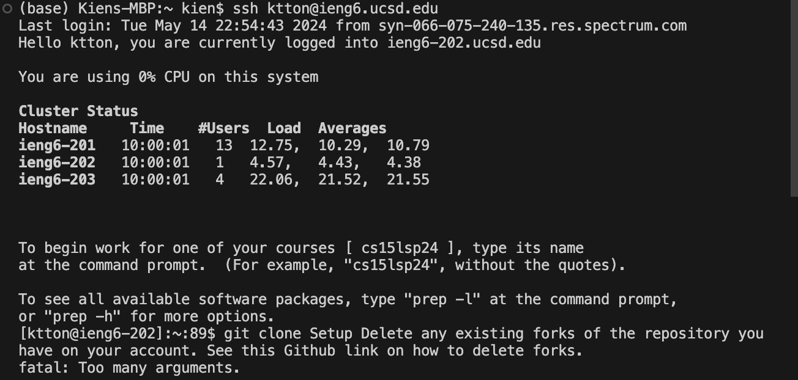
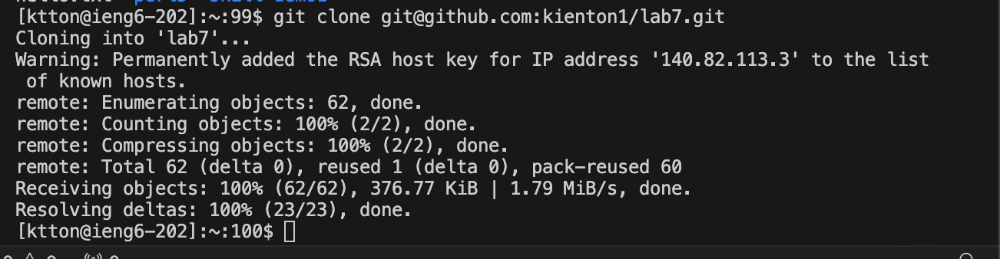
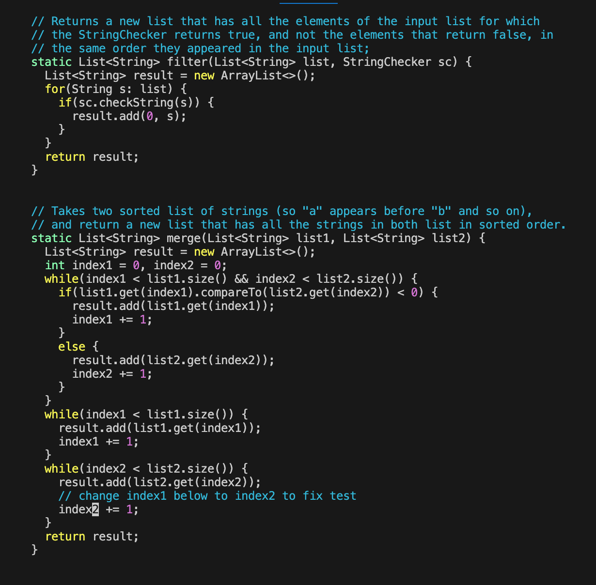
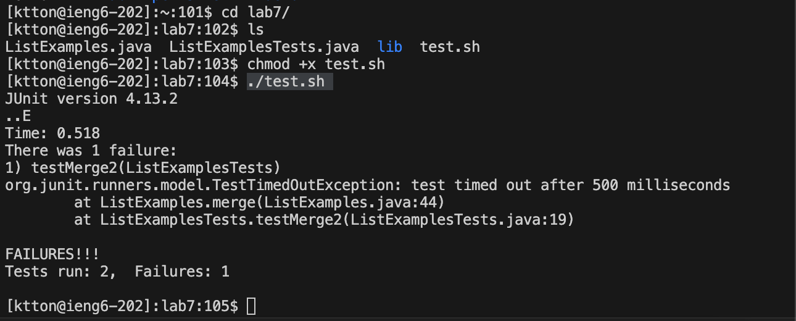
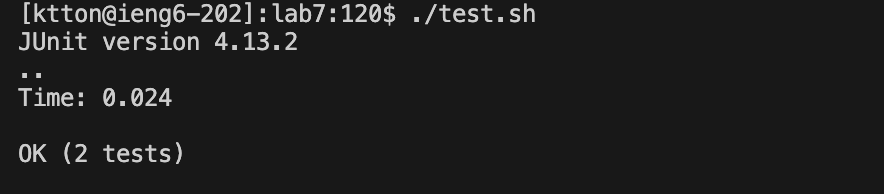
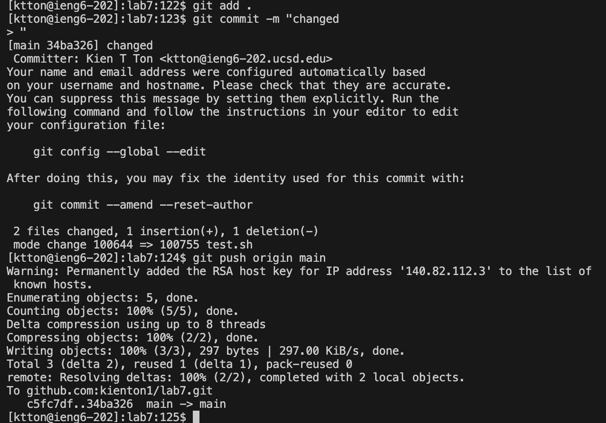

**Step 4**
<ssh ktton@ieng6.ucsd.edu> <enter> allows for me to get into the ieng6 machine.

**Step 5**
<pwd> <cd> <rm -r lab7/> <enter> <y> <enter> <y> <enter> This allows for me to delete the git clone that was names lab7 before adding the new clone. <git clone git@github.com:kienton1/lab7.git><enter> then allows for me to clone the lab7 repository.

**Step 6**
<cd lab7/><enter> Gets me into the lab7 directory <chmod +x test.sh><enter> allows for me to make the sh file into an executable then <./test.sh><enter> allows for me to run the sh test.

**Step 7**
<vim ListExamples.java><enter> allows for me to open up the vim editor on the ListExamples.java file. <up><up><up><right><right><right><right><right><right><right><right><right><r><2> This lets me change the error in the file by replacing a 1 with a 2.

**Step 8**
<:wq> This allows for me to save the changes that I made in the file and then exit the vim editor.<./test.sh ><enter> This lets me rerun the test.sh file so that this can compile and then run the `ListExamplesTests.java`.

**Step 9**
<git add .><enter> This command adds all the changes in all files in the folder into the staging area. Then by using <git commit -m "change"><enter> I am able to commit the changes in the staging area to the local repository. The message "change" can be any comment. <git push origin main><enter> Then this allows for me to change from my local repository to my GitHut repoitory.

