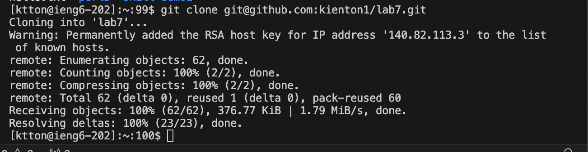
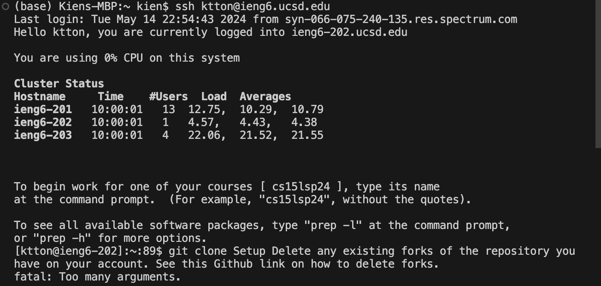

**Step 4**
<ssh ktton@ieng6.ucsd.edu> <enter> allows for me to get into the ieng6 machine.

**Step 5**
<pwd> <cd> <rm -r lab7/> <enter> <y> <enter> <y> <enter> This allows for me to delete the git clone that was names lab7 before adding the new clone. <git clone git@github.com:kienton1/lab7.git><enter> then allows for me to clone the lab7 repository.

**Step 6**
<cd lab7/> Gets me into the lab7 directory <chmod +x test.sh> allows for me to make the sh file into an executable then <./test.sh> allows for me to run the sh test.

